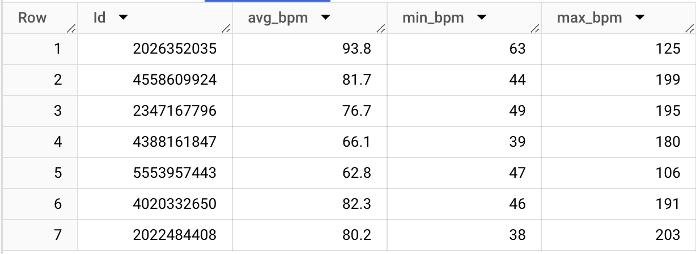
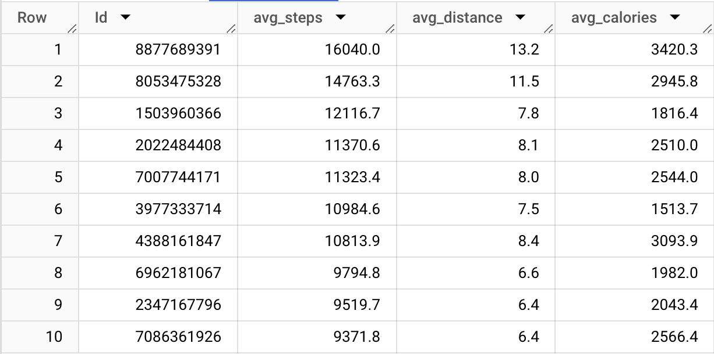
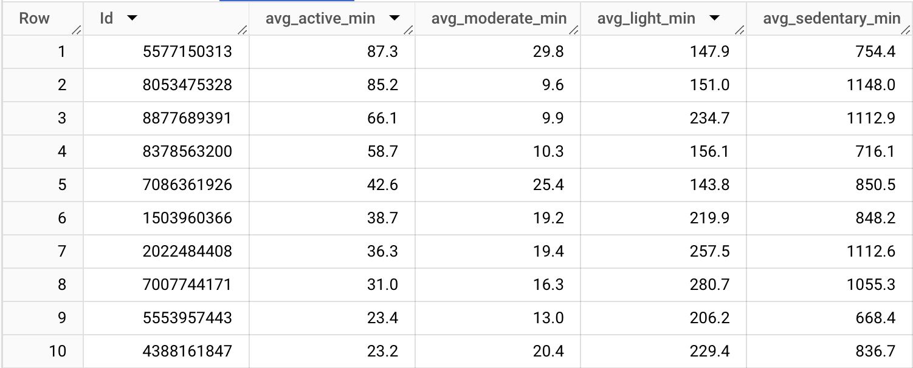
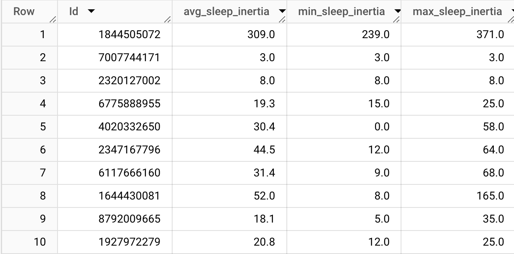
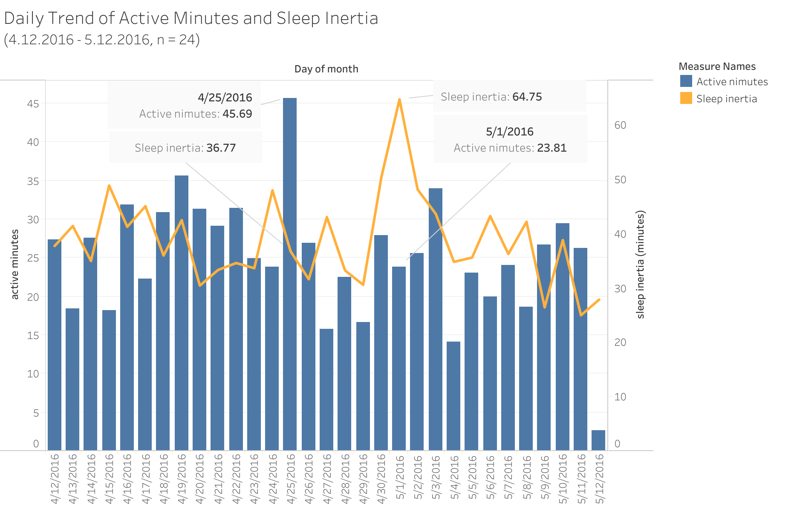
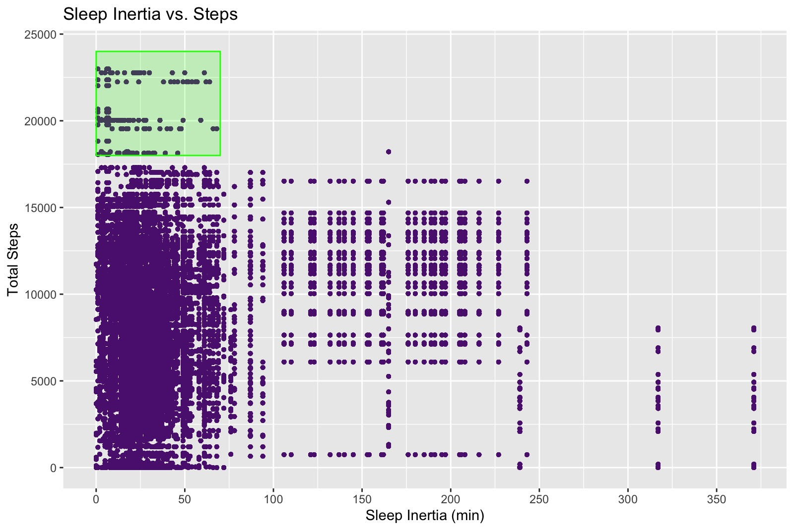
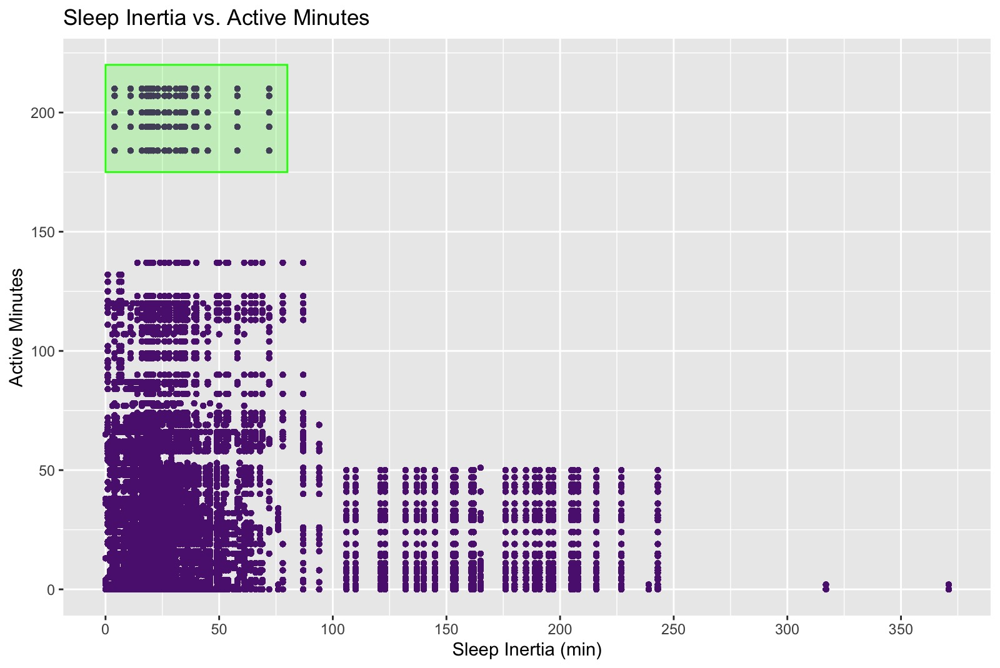
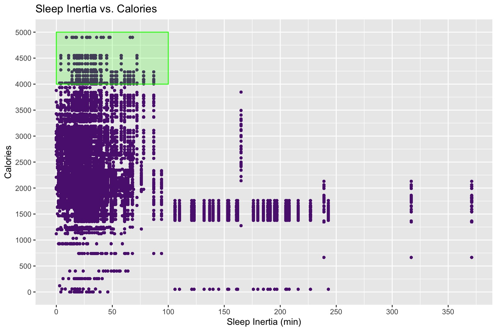
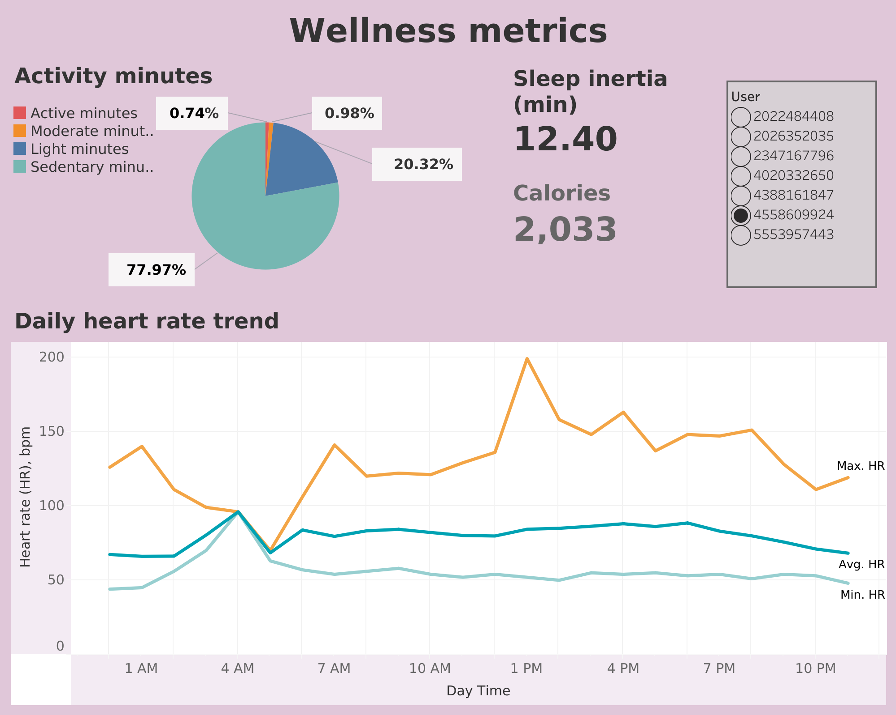

# Bellabeat Project

## About this project

Bellabeat is a high-tech company that manufactures health-focused smart products for women founded in 2013 by Urška Sršen and Sando Mur.
This technology tracks data on activity, sleep, stress, and reproductive health has allowed Bellabeat to empower women with
knowledge about their own health and habits. 

Business task of the project was to analyze smart device usage data in order to gain insights into how consumers use non-Bellabeat smart
devices and apply these insights into one Bellabeat product. Discovered insights will help guide marketing strategy for the company. 

The approach we employed in this case study was to explore daily and weekly trends of sleep patterns (sleep inertia) and find how they relate to user's daily activity.
Quality of sleep has the most impact on our daily life and energy level, so we decided to focus on this parameter.

**Questions:**
 - What are some trends in smart device usage?
 - What specific metrics indicate a more active lifestyle?
 - How could these trends impact Bellabeat marketing strategy?

## About the data
Dataset “FitBit Fitness Tracker Data” was generated by respondents to a distributed survey via Amazon Mechanical Turk between 04.12.2016-05.12.2016 and  kindly provided through [Mobius](https://www.kaggle.com/datasets/arashnic/fitbit?select=Fitabase+Data+4.12.16-5.12.16). Dataset consists of 18 csv files of 33 users who consented to provide personal tracker data that includes output for physical activity, heart rate, sleep monitoring, and  steps. Some tables are organized in long format, some organized in wide format. Upon closer examination we discovered that not all tables of the dataset have the same number of unique user Ids. For example, 'sleep_day' table has 24, 'daily_activity' - 33, and 'heart_rate_seconds' has only 8 unique users. These findings will limit some aspects of further analysis. To answer the above mentioned questions we decided to study the following metrics recorded daily: calories, total steps, total distance, different intensity minutes, time asleep, time in bed, heart rate.

**Tables**: daily_activity.csv, daily_calories.csv, heart_rate_seconds.csv, sleep_day.csv


## Cleaning process and data manipulation
Considering that the number of observations in some tables reach over 1 millions rows, we decided to use BigQuery Studio to perform our data manipulations in a series of SQL queries. We created a new dataset named ‘fitbit’ and uploaded all csv files while assigning new names following standards of naming conventions. Ensuring that the dataset is clean we checked Field and Type of data in the SCHEMA of selected tables. 
1. We identified that the ‘sleep_day’ table has a column named ‘SleepDay’ that is formatted as STRING instead of TIMESTAMP. So, we changed the format of that column, renamed columns to better reflect the data they describe. Also we added another column ‘sleep_inertia_min’ that reflects the difference between ‘TotalTimeInBed’  and ‘TotalMinutesAsleep’. Sleep inertia will be used as an important metrics that relates to a daily activity of a user:

```
SELECT Id,
     PARSE_TIMESTAMP('%m/%d/%y %I:%M %p', SleepDay) AS date,
     ROUND((TotalMinutesAsleep/60), 1) AS total_time_asleep_h,
     ROUND((TotalTimeInBed/60), 1) AS total_time_in_bed_h,
     (TotalTimeInBed - TotalMinutesAsleep) AS sleep_inertia_min
FROM `project-bellabeat-414921.fitbit.sleep_day`
;
```

Then, this query was saved as a new table named ‘sleep_inertia’ and downloaded to the local folder that contains the dataset.

2. The same formatting (STRING into TIMESTAMP) was done for column ‘Time’ in ‘heart_rate_seconds’ and used CAST function to separate date and time values and saved as new csv file named ‘clean_heart_rate’ in local folder. This table will be used in Tableau to reflect daily trends of heart rate:
```
WITH heart_rate_1 AS
      (SELECT Id,
              PARSE_TIMESTAMP('%m/%d/%y %I:%M %p', Time) AS time,
              Value
       FROM `project-bellabeat-414921.fitbit.heart_rate_seconds`)

SELECT Id,
       CAST(time AS date) AS date,
       CAST(time AS time) AS time,
       Value AS hr_bpm
FROM `heart_rate_1`
;
```


3. In order to perform analysis more efficiently we decided to combine columns with data we need in a single table from the following tables: ‘daily_activity’, ‘daily_calories’, and ‘sleep_inertia’. Using FULL OUTER JOIN clause allowed us  to include all data from all tables:

```
SELECT daily_activity.Id, 
       daily_calories.calories AS calories,
       daily_activity.TotalSteps AS total_steps,
       ROUND(daily_activity.TotalDistance, 2) AS total_distance,
       daily_activity.VeryActiveMinutes AS active_min,
       daily_activity.FairlyActiveMinutes AS mod_min,
       daily_activity.LightlyActiveMinutes AS light_min,
       daily_activity.SedentaryMinutes AS sed_min,
       sleep_inertia.total_time_asleep_h AS time_asleep_h,
       sleep_inertia.total_time_in_bed_h AS time_in_bed_h,
       sleep_inertia.sleep_inertia_min AS sleep_inertia_min

FROM project-bellabeat-414921.fitbit.daily_activity
FULL OUTER JOIN project-bellabeat-414921.fitbit.daily_calories ON daily_activity.Id = daily_calories.Id
FULL OUTER JOIN project-bellabeat-414921.fitbit.sleep_inertia ON daily_activity.Id = sleep_inertia.Id
```

Output of this query was saved as ‘filtered_data’ csv file in the local folder.

4. Since we also wanted to look into daily and weekly trends of sleep and activity patterns we combined two tables using JOIN clause with two fields ('Id' and 'date') to ensure  that Id and date values are matching. This query we saved as a csv file 'activity_sleep' which will be used to create visualizartions in Tableau.
```
SELECT  daily_activity.Id, 
        daily_activity.ActivityDate AS date,
        daily_activity.Calories AS calories,
        daily_activity.TotalSteps AS total_steps,
        ROUND(daily_activity.TotalDistance, 2) AS total_distance,
        daily_activity.VeryActiveMinutes AS active_min,
        daily_activity.FairlyActiveMinutes AS mod_min,
        daily_activity.LightlyActiveMinutes AS light_min,
        daily_activity.SedentaryMinutes AS sed_min,
        clean_sleep_day.total_time_asleep_h AS time_asleep_h,
        clean_sleep_day.total_time_in_bed_h AS time_in_bed_h,
        clean_sleep_day.sleep_inertia_min AS sleep_inertia_min,
        
FROM project-bellabeat-414921.fitbit.daily_activity
JOIN project-bellabeat-414921.fitbit.clean_sleep_day ON daily_activity.Id = clean_sleep_day.Id 
AND daily_activity.ActivityDate = clean_sleep_day.date
ORDER BY Id, date
;
```

## Descriptive statistics. 
- Finding average, minimun and maximum heart rate values of users. 

```
SELECT DISTINCT(user) as Id, 
     ROUND(AVG(hr_bpm), 1) AS avg_bpm,
     MIN(hr_bpm) AS min_bpm,
     MAX(hr_bpm) AS max_bpm
FROM `project-bellabeat-414921.fitbit.clean_heart_rate`
GROUP BY Id
;
```


Only 7 distinct Ids were returned. This table shows that the highest heart rate was  203 bpm and lowest 38 bpm, which overall tells about a very good fitness shape of a user with Id 2022484408. 
Based on this data almost all users lead an active lifestyle.


- Average values of steps, distance and calories for top 10 users sorted by steps in descending order:

```
SELECT DISTINCT(Id),
       ROUND(AVG(total_steps), 1) AS avg_steps,
       ROUND(AVG(total_distance), 1) AS avg_distance,
       ROUND(AVG(calories), 1) AS avg_calories
FROM `project-bellabeat-414921.fitbit.filtered_data`
GROUP BY Id
ORDER BY avg_steps DESC
LIMIT 10
;
```


The above table shows no relation between calories and steps taken (see rows 3, 6 and 7 in of the table). We can assume that calories spent per day may relate to personal basal metabolic rate (BMR) which indicates the number of calories a person burns as the body performs basic (basal) life-sustaining function. The higher the BMR the more calories the burns without  physical activities.


- Daily Average values of intensity minutes:

```
SELECT  DISTINCT(Id),
       ROUND(AVG(active_min), 1) AS avg_active_min,
       ROUND(AVG(mod_min), 1) AS avg_moderate_min,
       ROUND(AVG(light_min), 1) AS avg_light_min,
       ROUND(AVG(sed_min), 1) as avg_sedentary_min

FROM `project-bellabeat-414921.fitbit.filtered_data`
GROUP BY Id
ORDER BY avg_active_min DESC
LIMIT 10
;
```


- Average, minimum and maximum values of time asleep (in hours):
```
SELECT DISTINCT(Id),
       ROUND(AVG(time_asleep_h), 1) AS avg_time_asleep_h,
       ROUND(MIN(time_asleep_h), 1) AS min_time_asleep_h,
       ROUND(MAX(time_asleep_h), 1) AS max_time_asleep_h


FROM `project-bellabeat-414921.fitbit.filtered_data`
WHERE time_asleep_h is NOT Null
GROUP BY Id
LIMIT 10
;
```


There are abnormal values registered in this table, where some users have average sleep time 1 hour.


- Average, minimum and maximum values of sleep inertia (in minutes):

```
SELECT DISTINCT(Id),
       ROUND(AVG(sleep_inertia_min), 1) AS avg_sleep_inertia,
       ROUND(MIN(sleep_inertia_min), 1) AS min_sleep_inertia,
       ROUND(MAX(sleep_inertia_min), 1) AS max_sleep_inertia


FROM `project-bellabeat-414921.fitbit.filtered_data`
WHERE sleep_inertia_min is NOT Null
GROUP BY Id
LIMIT 10
;
```


The values in the first row returned average sleep inertia of 309 min (~5 hours) which might be incorrectly registered input of time in bed since average time asleep for this user is 10.8 hours
We decide to keep this observation. 


## Initial exploratory visualizations in Tableau and R Studio.
After performing descriptive statistics we moved our analysis into Tableau Public and R Studio to present data in visual form. 
The goal was to study relationships and patterns between sleep inertia and other observed wellness metrics.

First, we uploaded previously saved csv files to create barcharts in Tableau to demonstate how sleep inertia and daily actvity relate to each other.

1. The barchart below reflects day-to-day trend of avtive minutes and sleep inertia in a span of 30 days. It shows that at the highest activity minutes values the sleep inertia values are low, and the opposite is true.
   We cannot directly say that one causes the other since activity minutes might reflect days where users did some sports activities:


2. We also created barchart that shows weekday dynamics of active minutes and sleep inertia. Here sleep inertia is at the highest on Sunday where low activity minutes are registered.


Setting up environment:
```
libralry('tidyverse')
library('ggplot2')
library(readr)
```

Uploading 'filtered_data.csv':
```
> filtered_data <- read_csv("Desktop/Data Analytics/Google Data Analytics/
Case Study(Project)/Case Study - Bellabeat/Fitabase Data 4.12.16-5.12.16/filtered_data.csv")
```

First, we supply a function argument to scale ggplot. We use that function to calculate the tick locations:
```
number_ticks <- function(n) {function(limits) pretty(limits, n)}
```
Then we create a scatterplot **Sleep inertia vs Total Steps**:
```
ggplot(data=filtered_data,aes(x=sleep_inertia_min, y=total_steps)) + 
  geom_point(color='#5C1E7E', size = 1) +
  scale_x_continuous(breaks=number_ticks(10)) +
  labs(title = "Sleep Inertia vs. Steps") +
  xlab('Sleep Inertia (min)') +
  ylab('Total Steps') +
  annotate("rect", xmin=c(0), xmax=c(70), ymin=c(18000) , ymax=c(24000), alpha=0.2, color="green", fill="green")
```


NOTE: Area highlighted with green shows that the highest number of steps is attributed to lower sleep inertia.


Next we plot **Sleep Inertia vs Active Minutes**:
```
ggplot(data=filtered_data, aes(x=sleep_inertia_min, y=active_min)) + 
  geom_point(color='#5C1E7E', size = 1) +
  scale_x_continuous(breaks=number_ticks(10)) +
  labs(title = "Sleep Inertia vs. Active Minutes") +
  xlab('sleep inertia (min)') +
  ylab('active minutes') +
  annotate("rect", xmin=c(0), xmax=c(80), ymin=c(175), ymax=c(220), alpha=0.2, color="green", fill="green")
```




Additionally, we create scatterplot **Sleep Inertia vs Calories**:
```
ggplot(data=filtered_data, aes(x=sleep_inertia_min, y=calories)) + 
  geom_point(color='#5C1E7E', size = 1) +
  scale_x_continuous(breaks=number_ticks(10)) +
  scale_y_continuous(breaks=number_ticks(10)) +
  labs(title = "Sleep Inertia vs. Calories") +
  xlab('Sleep Inertia (min)') +
  ylab('Calories') +
annotate("rect", xmin=c(0), xmax=c(100), ymin=c(4000), ymax=c(5000), 
alpha=0.2, color="green", fill="green")
```



## Summary of analysis and key findings:
 - Exploratory Data Analysis (EDA) using RStudio allowed us to identify that Sleep Inertia (the difference between ‘time asleep’ and ‘time in bed’) may serve as an additional indicator of activity level and better quality lifestyle in addition to other metrics.
- On three different scatter plots shown above it is important to notice that most of the user’s sleep inertia values in this study fell between 0 and 100 min. There are some users with sleep inertia between 100 and 350 min.
- We can assume that the users with higher daily activity levels (based on calories,  total steps, total distance and active minutes) tend to have lower sleep inertia values (between 0 and 75 minutes). At the same time users with high values of sleep inertia (between 100 and 375 min) spent less calories, did less steps, and had less active minutes.
- Although statistically significant correlations were not found between sleep inertia and calories burnt, total steps, total distance and active minutes. Further analysis required with larger data sample to establish relations between these parameters. Exploring daily activity patterns of users with lower sleep inertia may provide better understanding of healthy and active lifestyle.


## Recommendations.
Phenomenon of sleep inertia is well outlined in the article by [Tanja Premru-Sršen, M.D., Ph.D.](https://bellabeat.com/sleep/sleep-inertia/).

Adding additional measurement to Ivy Health Tracker that monitors sleep inertia will greatly improve users' awareness and understanding about resting and activity status. Low sleep inertia reflects better quality of sleep and higher energy level, and vice versa. 


## Creating an interactive dashboard in Tableau. 
To demonstrate relations between sleep inertia and calories, activity minutes and  heart rate, we created an interactive dashboard [Wellnes metrics](https://public.tableau.com/views/Dailyheartratetrend/Dashboard1?:language=en-US&:sid=&:display_count=n&:origin=viz_share_link). By using filter ‘user’  this dashboard demonstrates how key metrics change from user to user. Since the heart rate dataset was limited to only 7 distinct user Ids, the filter has only 7 options. There is one user that has no data on ‘sleep inertia’




